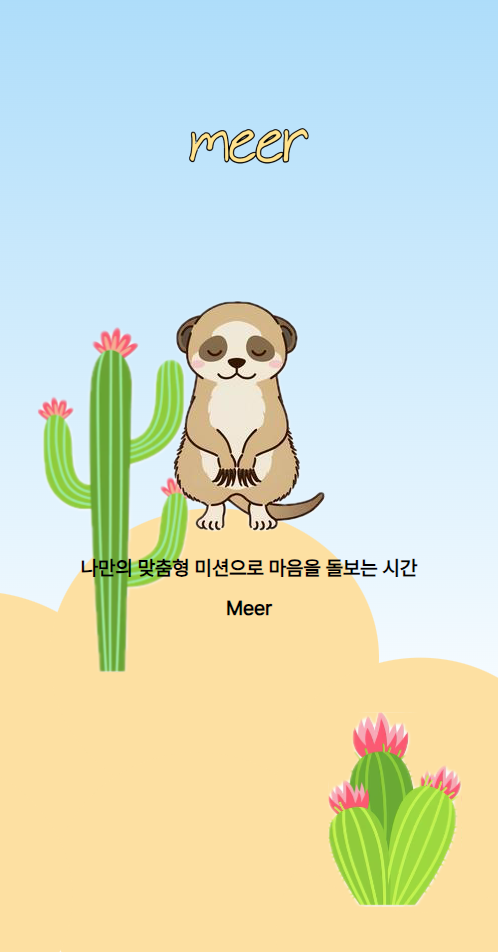
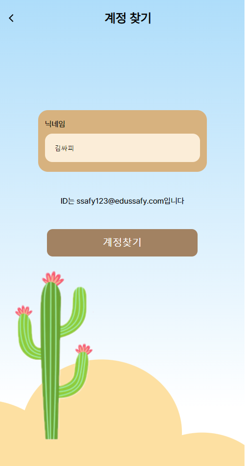
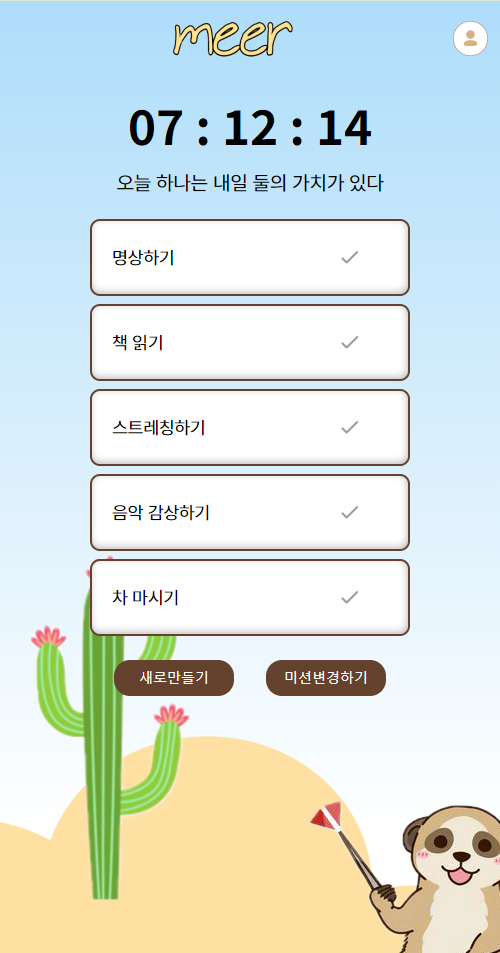

# 🦊 Meer

## 프로젝트 소개

- AI가 추천해주는 나만의 맞춤형 미션으로 마음을 돌보는 시간
- 이미지 생성을 통해 나만의 미션 이미지 만들기

---

## 1. 개발 환경

- Java, SpringBoot(MyBatis)
- 버전 및 이슈관리 : Github, Github Issues, Github Project
- 협업 툴 : Notion, Figjam
- 디자인 : Figma

## 2. 개발 기간 및 작업 관리

### 개발 기간

- 전체 개발 기간 : 2024-05-13 ~ 2024-05-23
- UI 구현 : 2024-05-13 ~ 2024-05-16
- 기능 구현 : 2024-05 -17 ~ 2024 -05-23

### 작업 관리

- Github Projects와 Issues를 사용하여 진행 상황 공유
- Notion에 있는 기능 명세와 API 명세서에 체크를 하여 현재 진행 상황 확인

---

## 3-1. 공통 기능

### [배경 테마 전환]
- 저녁 6시를 기준으로 낮 테마에서 밤 테마로 변경
  - 하늘색상 및 폰트 색상 일부 변경됨

<table>
  <tr>
    <td align="center">
       낮 테마
    </td>
    <td align="center">
       밤 테마
    </td>
  </tr>
</table>

### [JWT 인증]
- 로그인 시에 jwToken을 발행하여 local Storage에 저장
- 이후 로그인 및 계정찾기 활동을 제외한 모든 page 접속, 라우팅, action을 할 때 토큰여부를 파악하여 유효한 토큰을 가진 사람만 프로그램 이용 가능

## 3-2. 페이지별 기능

### [초기화면]

- 서비스 접속 초기화면으로 맨 처음에만 소개페이지가 5초 동안 보여진 뒤 로그인 페이지가 나타납니다.
  - 회원가입이 되어있는 경우 → 로그인 진행
  - 회원가입이 되어있지 않은 경우 → 회원가입 진행
  - 아이디 혹은 비밀번호를 까먹었을 시 계정 찾기와 비밀번호 찾기로 이동

<table>
  <tr>
    <td align="center">
       초기화면
    </td>
    <td align="center">
       로그인화면
    </td>
  </tr>
</table>

### [회원가입]

- 이메일 정규식과 비밀번호 정규식을 도입하여 형식에 맞게 입력하게 하였습니다.
- 중복 확인 클릭 시 기존에 있는 닉네임, 이메일인지 확인합니다.
  - 아이디 중복확인 클릭 시 DB에 있는 해당 아이디를 찾고 해당 아이디가 없으면 정상적으로 회원가입이 진행됩니다.
- 유효성 검사와 중복 검사가 통과되면 회원가입 버튼을 눌러 최종적으로 확인하고 로그인 화면으로 돌아갑니다.

### [계정 찾기, 비밀번호 찾기]

계정 찾기

<table>
  <tr>
    <td align="center">
       닉네임 입력 전
    </td>
    <td align="center">
       닉네임 입력 후 
    </td>
  </tr>
</table>

비밀번호 찾기

- 비밀번호 찾기는 2단계로 구성되어 있습니다. 결과는 모달로 나타납니다.
  - 먼저 아이디를 입력하여 유효한 이미지인지 확인합니다.
    - 유효한 아이디 여부는 고객이 입력한 아이디를 DB에서 찾아서 존재하면 유효한 아이디로 판단합니다.
  - 유효한 아이디면 새 비밀번호 설정을 하여 비밀번호 변경을 합니다. 변경 결과는 모달로 나타납니다.

<table>
  <tr>
    <td align="center">
       비밀번호 찾기 1
    </td>
    <td align="center">
       비밀번호 찾기 2
    </td>
        <td align="center">
       모달창
    </td>
  </tr>
</table>

### [메인페이지]

- 미션이 있는 경우 다음과 같이 미션을 체크할 수 있는 페이지가 나타납니다.
  - 미션이 있는 경우에는 새로만들기, 미션변경하기가 추가됩니다.
  - 자정을 기준으로 체크를 초기화하므로 그에 따른 카운트다운 기능이 부여됩니다.
    - 스프링의 Scheduled기능을 활용하여 매 자정마다 DB의 모든 미션 체크를 false로 만들었습니다.
- 미션이 없는 경우 미션페이지 생성으로 이동할 수 있습니다.
- 둘 다 공통적으로 마이페이지, 로그아웃, 요깃거리라는 버튼을 클릭하여 사이트로 이동할 수 있습니다.
  - 데일리 랜덤 글귀를 백엔드로부터 받아 매일 다른 글귀를 볼 수 있습니다.

<table>
  <tr>
    <td align="center">
       미션이 있을 경우
    </td>
    <td align="center">
       미션이 없을 경우
    </td>
  </tr>
</table>

### [마이페이지]

1. 포츈쿠키 : 매일 누를 수 있으며 누르기 전이랑 후의 렌더링을 다르게 처리하였습니다.
   - Scheduled기능을 활용하여 매 자정마다 포츈쿠키의 체크여부를 false로 만들고, 회원별로 포츈쿠키 번호를 random하게 지정해주었습니다.
2. 달력 : 매일매일 미션 체크 수에 따라 자정을 기준으로 전날 기록을 업데이트를 하며 달성도 갯수에 따라 색깔을 다르게 하여 달력에 나타납니다.
   - 매 자정마다 회원별로 전날의 미션체크의 true의 갯수를 모두 수합해서 db에 저장합니다. 해당 db자료를 클라이언트에 보내면 미션 갯수에 따라 달력에 표시됩니다.
3. 비밀번호 변경 : 비밀번호 변경 모달을 통해서 기존 비밀번호와 새 비밀번호를 입력하게 하고 그에 따른 결과를 나타냅니다.

<table>
  <tr>
    <td align="center">
       포츈 열기 전
    </td>
    <td align="center">
       포츈 연 후
    </td>
  </tr>
</table>

### [미션 생성]

- 3단계를 걸쳐 1,2단계에서는 주제, 키워드를 선택하게 합니다. 선택이 되지 않으면 다음으로 넘어갈 수 없습니다.
- Single Page로 이루어져있기 때문에 도중에 그만두게 되면 처음부터 다시 시도하게 됩니다.
- 주제와 키워드를 주게 되면 AI가 그에 맞는 미션을 생성해주며 세부내용을 볼 수 있습니다.
  - 고객이 키워드와 상황을 체크하면 해당 정보들을 DB에 저장해둡니다. 그리고 해당 정보들을 가지고 프롬프트를 작성하여 5가지 미션을 생성합니다.
    - 이 때, 미션은 클라이언트에서 가공할 수 있도록 프롬프트에 정확한 양식을 기재하여 틀에 벗어나지 않는 답변을 주도록 작성했다.
  - 미션 생성 시 시간이 소요되기 때문에 로딩 스피너를 추가하여 작동되고 있음을 나타내줍니다.
- 3단계의 경우 3번의 변경 기회가 주어지며 완료하기를 눌렀을 시 메인페이지로 넘어가게 됩니다.
  - 변경을 클릭하면 DB에 저장해두었던 키워드와 상황을 가지고 와서 기존의 미션과 겹치지 않는 미션으로 새로 미션을 짜도록 프롬프트를 작성하였다.

<table>
  <tr>
    <td align="center">
       1단계
    </td>
    <td align="center">
       2단계
    </td>
        <td align="center">
       최종
    </td>
  </tr>
</table>

### [미션 체크]

- 미션체크는 개별적으로 선택이 가능하며 선택을 했을 시 색상이 달라지게 됩니다.
- 서버한테 put method를 요청하고 다시 전체 미션 정보를 받는 것이 아니라 프론트측에서 처리를 하여 새로고침하였을 때 해당 정보와 일치하도록 처리하였습니다.

<table>
  <tr>
    <td align="center">
       미션 체크
    </td>
  </tr>
</table>

### [미션 수정]

- 미션 수정은 매일 10번씩 주어지며 본인이 선택한 주제와 키워드에 따라서 개별적으로 미션을 변경해줍니다.
  - 개별 미션수정을 클릭하면 고객이 체크한 키워드, 환경, 기존 미션제목을 DB에서 불러와서 동일한 환경에서 기존미션과 다른 미션이 생성되도록 프롬프트를 작성하였습니다.
  - 10번을 다 소진하였을 시 미션 변경이 불가능하게 처리하였습니다.
- 변경된 미션은 기존과 겹치지 않게 생성이 되며 수정된 미션이 생성되었을 시 자동적으로 체크가 안된 것으로 처리가 됩니다.
  - 미션 변경 또한 생성과 마찬가지로 시간이 소요되기 때문에 로딩 스피너를 추가하여 작동되고 있음을 나타내줍니다.

<table>
  <tr>
    <td align="center">
       미션 수정
    </td>
  </tr>
</table>

### [미션 이미지 생성]

- 이미지 생성을 원하는 미션버튼을 클릭하게 되면 open AI를 이용하여 그에 맞는 이미지를 생성하게 됩니다.
  - 이미지 생성 시 시간이 소요되기 때문에 로딩 스피너를 추가하여 작동되고 있음을 나타내줍니다.
- 이미지가 나타나게 되면 저장하기라는 버튼이 추가되고 버튼추가를 누르면 해당 AI가 만든 이미지를 다운로드 하게끔 처리하였습니다.

<table>
  <tr>
    <td align="center">
       미션 이미지 생성
    </td>
    <td align="center">
       이미지 저장
    </td>
  </tr>
</table>

## 4. ChatGPT 프롬프트

### [미션생성 프롬프트]
- 미션생성프롬프트는 BackEnd단에서 작성되었습니다.
- 미션 생성프롬프트는 미션 초기생성, 미션 재생성, 일부 변경의 총 3가지 프롬프트로 구성됩니다.

 1. 미션 초기생성 프롬프트
> "너는 이제부터 사람들의 고민을 해결해주는 상담사야. 누군가 너에게 상담을 요청해왔어.  이 사람의 (주제) 을 개선시킬 데일리 미션을 5개 만들려고 해. 
세부조건은 다음과 같아. 
 1. 행동양식은 (행동양식1 - 움직임의 정도에 따른 행동양식)이야. 
 2. 미션을 하는 공간은 (행동양식2 - 실내·외 or 상관없음 선택)이야. 
 3. 미션을 하는 시간대는 (행동양식3 - 오전, 오후, 저녁) 이야. 
  미션마다 첫번 째 줄에는 미션번호를 숫자로 적어줘(ex) 1,2,3,4,5) 
 두번째 줄에는 미션제목을 '~하기'의 형태로 한 줄 적어줘. 
 다음 줄에는 미션에 대한 구체적인 행동양식을 '~하기'의 형태로 한 줄 정리해줘.  미션과 미션 사이는 한 줄 띄어줘. 미션제목이나, 구체적인 행동양식 같은 어구들은 빼고 딱 미션에 대한 내용만 담아줘" 

2. 미션 재생성 프롬프트
> "너는 이제부터 사람들의 고민을 해결해주는 상담사야. 누군가 너에게 상담을 요청해왔어.  이 사람의 (주제) 을 개선시킬 데일리 미션을 5개 만들려고 해. 
세부조건은 다음과 같아. 
 1. 행동양식은 (행동양식1 - 움직임의 정도에 따른 행동양식)이야. 
 2. 미션을 하는 공간은 (행동양식2 - 실내·외 or 상관없음 선택)이야. 
 3. 미션을 하는 시간대는 (행동양식3 - 오전, 오후, 저녁) 이야. 
  미션마다 첫번 째 줄에는 미션번호를 숫자로 적어줘(ex) 1,2,3,4,5) 
 두번째 줄에는 미션제목을 '~하기'의 형태로 한 줄 적어줘. 
 다음 줄에는 미션에 대한 구체적인 행동양식을 '~하기'의 형태로 한 줄 정리해줘. 
 대신, 다음의 5가지 미션은 빼고 새로운 미션으로 만들어줘야해. 빼야할 5가지 미션은 다음과 같아.
 (기존의 미션제목 5개나열)
 미션과 미션 사이는 한 줄 띄어줘. 미션제목이나, 구체적인 행동양식 같은 어구들은 빼고 딱 미션에 대한 내용만 담아줘"

3. 미션 일부 변경 프롬프트
> "너는 이제부터 사람들의 고민을 해결해주는 상담사야. 누군가 너에게 상담을 요청해왔어.  이 사람의 (주제) 을 개선시킬 데일리 미션을 1개 만들려고 해.
 기존의 미션들은 제외하고 다른 미션으로 만들어줘.
 기존의 미션은 (기존의 미션제목 5개나열)가 있어.
  데일리 미션을 만드는데 있어 세부조건은 다음과 같아. 
 1. 행동양식은 (행동양식1 - 움직임의 정도에 따른 행동양식)이야. 
 2. 미션을 하는 공간은 (행동양식2 - 실내·외 or 상관없음 선택)이야. 
 3. 미션을 하는 시간대는 (행동양식3 - 오전, 오후, 저녁) 이야. 
 미션은 한개만 만들면 되고, 첫번 째 줄에는 미션제목을 '~하기'의 형태로 한 줄 적어줘.
 다음 줄에는 미션에 대한 구체적인 행동양식을 '~하기'의 형태로 한 줄 정리해줘. 
 미션과 미션 사이는 한 줄 띄어줘. 미션제목이나, 구체적인 행동양식 같은 어구들은 빼고 딱 미션에 대한 내용만 담아줘"

### [이미지생성 프롬프트]
- 미션생성 프롬프트는 FrontEnd단에서 작성되었습니다.
> draw about (선택한 미션제목)
